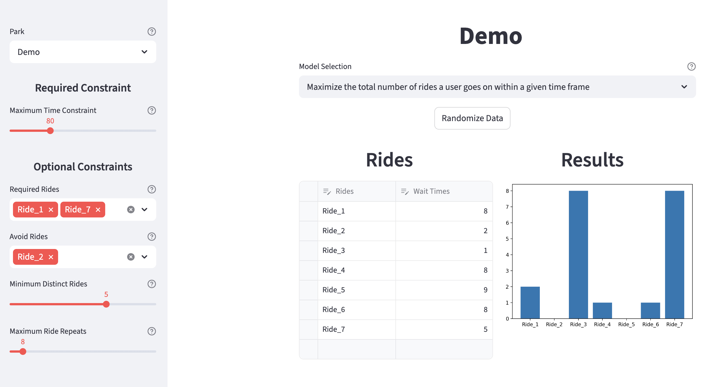

# Table of Contents
- [Table of Contents](#table-of-contents)
- [Project Description](#project-description)
- [Optimization Models](#optimization-models)
- [Park Data](#park-data)
- [Formal Overview of Optimization Problems](#formal-overview-of-optimization-problems)

# Project Description
This is an interactive web app that uses [integer programming](https://en.wikipedia.org/wiki/Integer_programming) to solve optimization problems involving wait times for amusement park rides.

This app uses [Streamlit](https://github.com/streamlit/streamlit) for the front-end and [PuLP](https://github.com/coin-or/pulp) to solve the optimization problems.

# Optimization Models
> Formal descriptions of each problem can be found [here](#formal-overview-of-optimization-problems)

### Objective Functions
1. Maximize the total number of rides a user goes on within a given time frame
2. Minimize the total amount of time a user spends waiting in line to go on rides

### Constraints (Maximization Problem)
* How many minutes the user is willing to spend waiting in line to go on all rides within the optimal solution
* Which rides the users want to go on at least once
* Which rides the user wants to avoid entirely
* The minimum number of distinct rides the user wants to go on at least once
* The maximum number of times the user wants to repeat going on a ride

### Constraints (Minimization Problem)
* How many total rides the user wants to go on within the optimal solution
* Which rides the users want to go on at least once
* Which rides the user wants to avoid entirely
* The minimum number of distinct rides the user wants to go on at least once
* The maximum number of times the user wants to repeat going on a ride

## Model Assumptions
These models assume that all ride wait times are constant and do not change.

# Park Data
This app features a **Demo** mode to use randomly-generated data as input for the optimization models.

This app also includes real-time ride wait times for the following California amusement parks:
* **Disneyland Resort Magic Kingdom**
* **Disneyland Resort California Adventure**
* **Universal Studios**

The real-time amusement park data is from: https://themeparks.wiki/

# Formal Overview of Optimization Problems

## Maximization Problem

### Variables
Let R be the set of all unique rides $r_i$ at a given park P

Let $r_{(i, o)}$ be the number of times a user goes on ride $r_i$

Let $r_{(i, w)}$ be the wait time to go on ride $r_i$

Let $w := \sum_{r_i \in R}r_{(i, o)} \cdot r_{(i, w)}$
> $w$ is the total amount time a user spends waiting in line to go on rides

### User-defined Variables
Let $t$ be the maximum cummulative sum a user is willing to spend waiting in line to go on rides

Let $m$ be the maximum number of times a user is willing to repeat going on any given ride $r_i$

Let $d$ be the minimum number of distinct rides a user wants to go on at least once

Let $r_{(i, p)}$ be a ternary variable indicating whether a user wants to go on ride $i$ at least once, or avoid it entirely
* $r_{(i, p)} = 0$ implies that the user wants to avoid $r_i$ entirely
* $r_{(i, p)} = 1$ implies that the user wants to go on $r_i$ at least once
* $r_{(i, p)} = 2$ implies that the user has no preference

Let $r_{(i, u)}$ be a binary variable keeping track of whether a user has gone on ride $r_i$ at least once:
* $r_{(i, u)}$ = 1 implies that the user has gone on ride $r_i$ at least once
* $r_{(i, u)}$ = 0 imples that the user has not gone at ride $r_i$

### Objective Function
$\max \sum_{r_i \in R} r_{(i, o)}$

### Constraints
$\\forall {r_i \in R}, r_{(i, o)} <= m$

$w <= t$

$r_{(i, p)} = 1 \implies r_{(i, o)} \geq 1$

$r_{(i, p)} = 0 \implies r_{(i, o)} = 0$

$r_{(i, o)} \geq r_{(i, u)}$

$\sum_{r_i \in R} r_{(i, u)} \geq d$

$r_{(i, o)}, r_{(i, w)}, t, d, m \in \mathbb{N}^+$

$r_{(i, u)} \in \{0, 1\}$

$r_{(i, p)} \in \{0, 1, 2\}$

## Minimization Problem

### Variables
Let R be the set of all unique rides $r_i$

Let $r_{(i, o)}$ be the number of times a user goes on ride $r_i$

Let $r_{(i, w)}$ be the wait time to go on ride $r_i$

### User-defined Variables
Let $d$ be the minimum number of distinct rides a user wants to go on at least once

Let $m$ be the maximum number of times a user is willing to repeat going on a ride

Let $t$ be the minimum number of total rides a user wants to go on

Let $r_{(i, p)}$ be a ternary variable indicating whether a user wants to go on ride $i$ at least once, or avoid it entirely
* $r_{(i, p)} = 0$ implies that the user wants to avoid $r_i$ entirely
* $r_{(i, p)} = 1$ implies that the user wants to go on $r_i$ at least once
* $r_{(i, p)} = 2$ implies that the user has no preference

Let $r_{(i, u)}$ be a binary variable keeping track of whether a user has gone on ride $r_i$ at least once
* $r_{(i, u)}$ = 1 implies that the user has gone on ride $r_i$ at least once
* $r_{(i, u)}$ = 0 imples that the user has not gone at ride $r_i$

### Objective Function
$\min \sum_{r_i \in R} r_{(i, w)}$

### Constraints
$\sum_{r_i \in R} r_{(i, o)} \geq t$

$\\forall {r_i \in R}, r_{(i, o)} <= m$

$r_{(i, p)} = 1 \implies r_{(i, o)} \geq 1$

$r_{(i, p)} = 0 \implies r_{(i, o)} = 0$

$r_{(i, o)} \geq r_{(i, u)}$

$\sum_{r_i \in R} r_{(i, u)} \geq d$

$r_{(i, o)}, r_{(i, w)}, d, m, t \in \mathbb{N}^+$

$r_{(i, u)} \in \{0, 1\}$

$r_{(i, p)} \in \{0, 1, 2\}$
